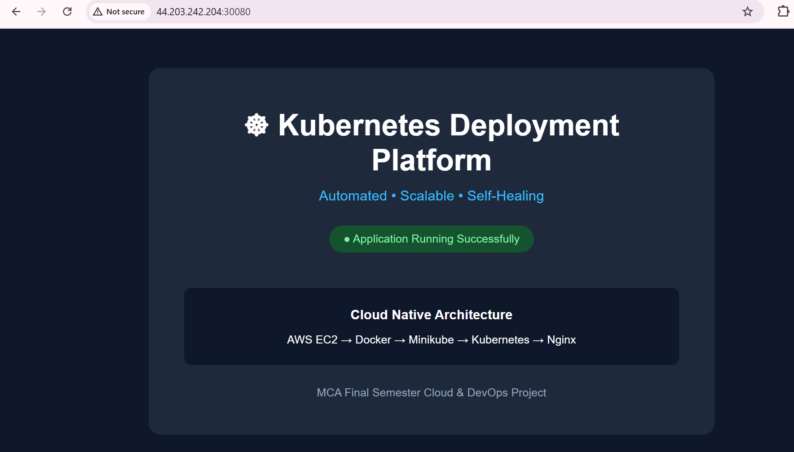
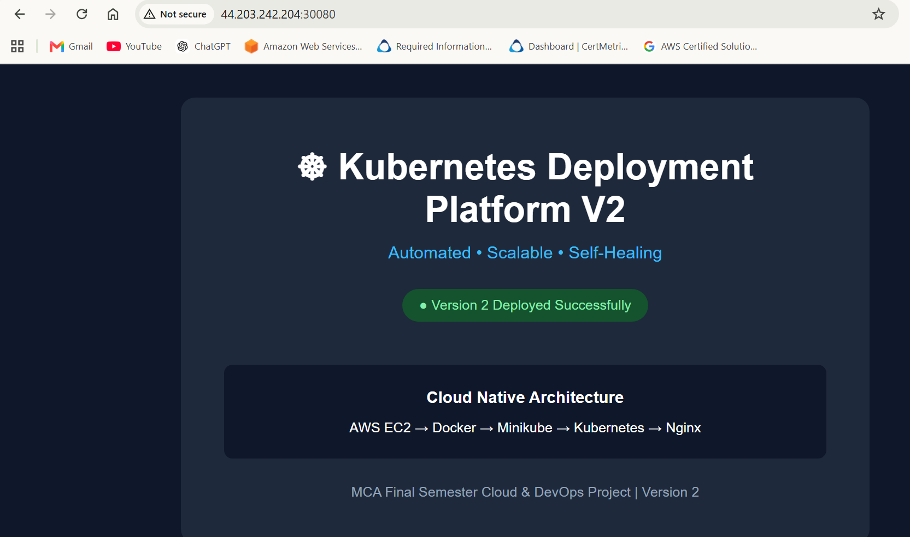
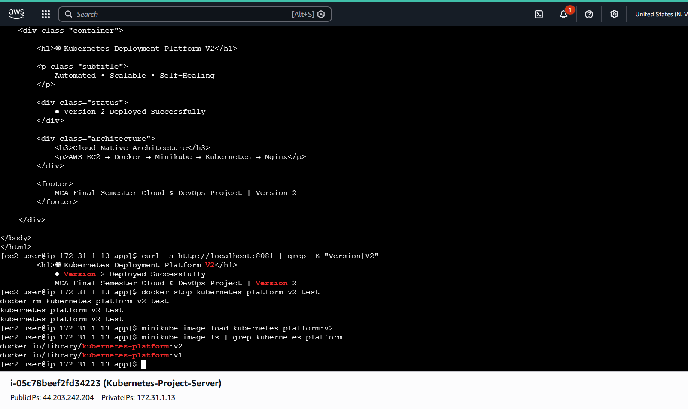
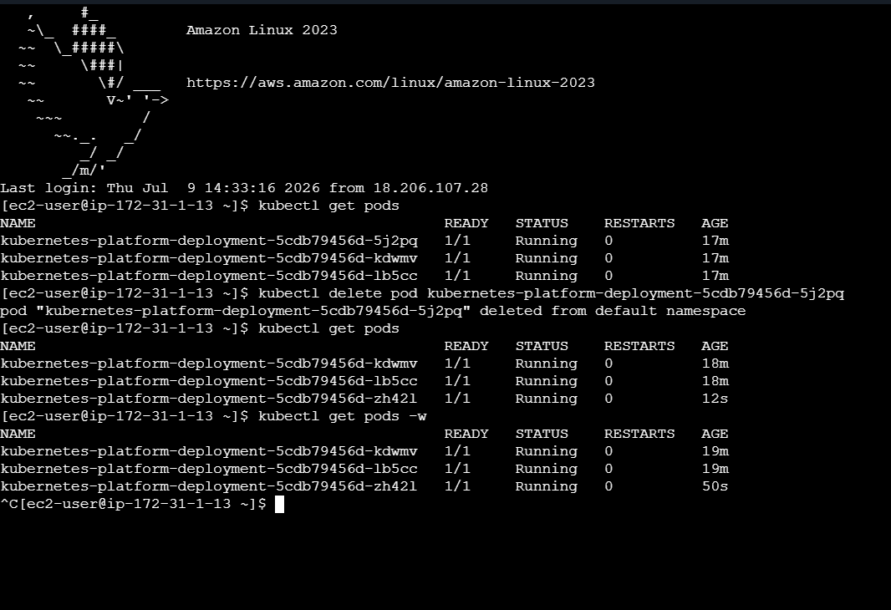
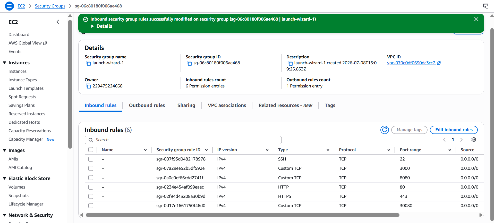

# Kubernetes-Based Application Deployment Platform

A cloud-native application deployment platform built using AWS EC2, Docker, Minikube, Kubernetes, and Nginx. The project demonstrates containerized application deployment, scalability, self-healing, rolling updates, rollback, health monitoring, and automatic pod scaling.

## Architecture

User Request → AWS EC2 → Kubernetes NodePort Service → Kubernetes Pods → Nginx → Web Application

## Technologies Used

- AWS EC2
- Amazon Linux 2023
- Docker
- Minikube
- Kubernetes
- kubectl
- Nginx
- HTML and CSS
- Git and GitHub

## Key Features

- Containerized web application using Docker
- Kubernetes deployment with multiple replicas
- Application exposure using a NodePort service
- Automatic pod recovery and self-healing
- Rolling application updates
- Kubernetes deployment rollback
- CPU and memory resource management
- Metrics Server for resource monitoring
- Horizontal Pod Autoscaler for automatic scaling
- Liveness probes for container health monitoring
- Readiness probes for traffic management

## Project Structure

```text
kubernetes-deployment-platform/
├── app/
│   ├── index.html
│   └── Dockerfile
├── k8s/
│   ├── deployment.yaml
│   └── service.yaml
├── .gitignore
└── README.md
```

## Deployment Steps

1. Build the Docker image:

    docker build -t kubernetes-platform:v1 ./app

2. Load the Docker image into Minikube:

    minikube image load kubernetes-platform:v1

3. Deploy the application to Kubernetes:

    kubectl apply -f k8s/deployment.yaml

4. Create the NodePort service:

    kubectl apply -f k8s/service.yaml

5. Verify the deployment:

    kubectl get deployments
    kubectl get pods
    kubectl get services

6. Access the application:

    http://EC2-PUBLIC-IP:30080


## Kubernetes Features Demonstrated

- Three application replicas for high availability
- Automatic pod recovery and self-healing
- Rolling application updates with zero downtime
- Kubernetes deployment rollback
- CPU and memory resource requests and limits
- Metrics Server for resource monitoring
- Horizontal Pod Autoscaler with a minimum of 2 and maximum of 6 replicas
- Liveness probe for container health monitoring
- Readiness probe for application traffic management

## Project Screenshots

### 1. Kubernetes Application – Version 1



### 2. Kubernetes Application – Version 2



### 3. Kubernetes Rolling Update – Version 2



### 4. Kubernetes Pods Running



### 5. AWS EC2 Security Group Configuration



## Author

Gowtham B

MCA Student | AWS Certified Cloud Practitioner

Interested in Cloud Computing, AWS, DevOps, Docker, and Kubernetes
